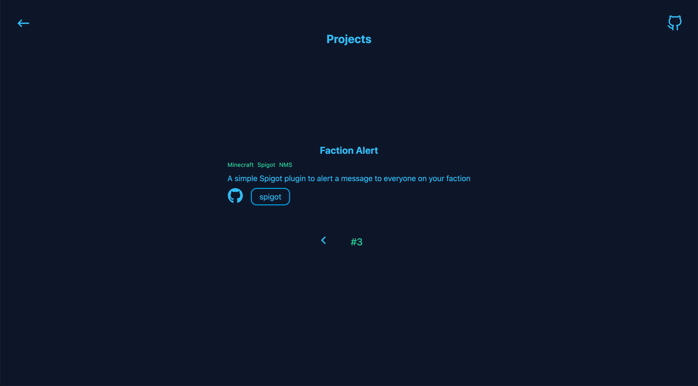
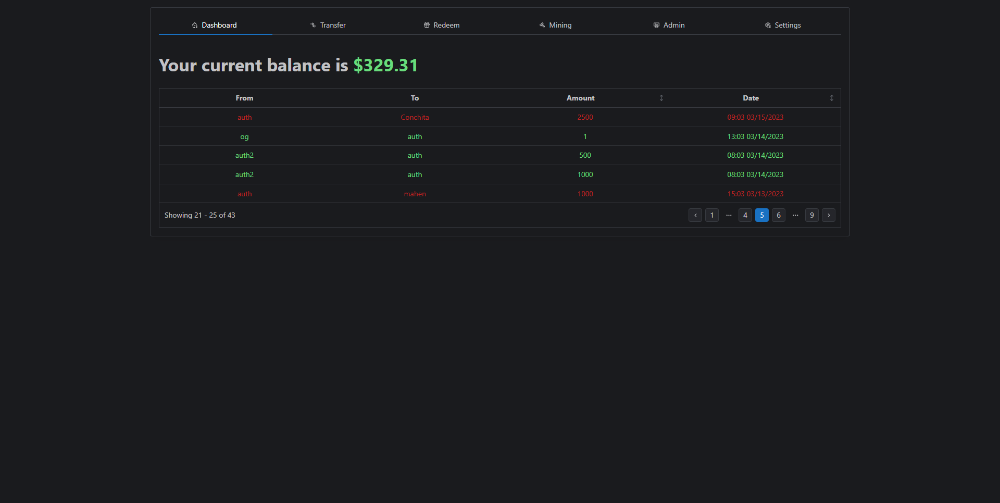
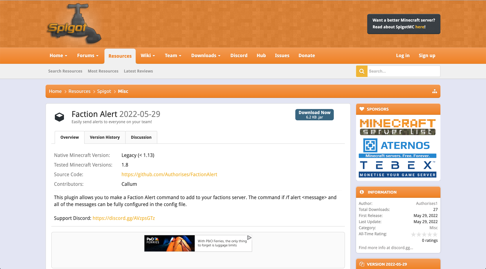
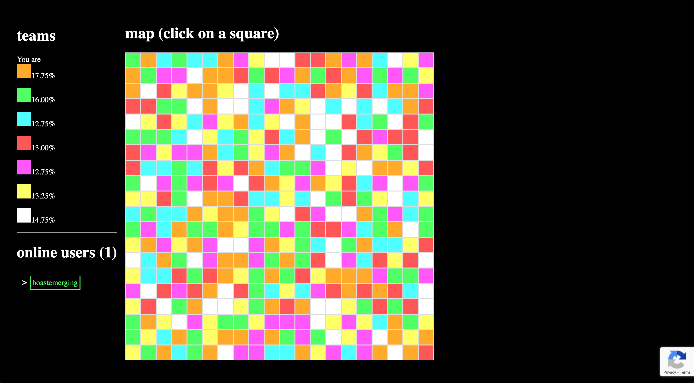
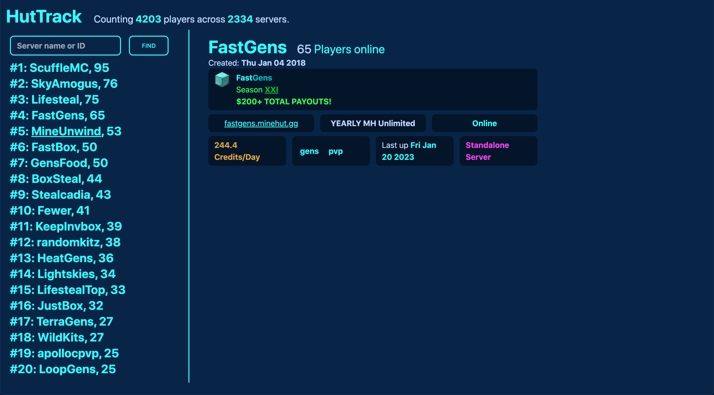

## Hello, I'm Authorises
### I enjoy coding and gaming.
### I am currently working on [Instinctia Network](https://github.com/InstinctiaNetwork)

## Experience:
- Html/Css
- Python
- Java
- Bukkit and Spigot API
- Linux and System Administration

## Notable Projects:

### [Portfolio](https://github.com/Authorises/Portfolio) This is a basic and clean portfolio where you can tell people a bit about yourself and showcase your projects using JSON. [Demo Here](https://authorises.vercel.app)

### [Ashbucks](https://github.com/Authorises/Portfolio) A fun centralised online money system (Not linked to USD in any way) which has mining and transactions.
[Demo Here](https://ashbucks.vercel.app)

### [Faction Alert](https://github.com/Authorises/FactionAlert) A simple spigot plugin that allows you to add a command to factions to alert everyone on your team a message.

### [Paint](https://github.com/Authorises/paint) A simple Node.JS and Socket.IO game where there is a 20x20 board and players fight for control over it! Test it out [Here](https://paint.authorises.repl.co) *(It might take 10s to load)*

### [HutTrack](https://github.com/huttrack/huttrack.github.io) A simple frontend for viewing the Minehut server list using it's API. You can check it out [Here](https://huttrack.github.io) *(Separate organisation to get the .github.io domain)*

